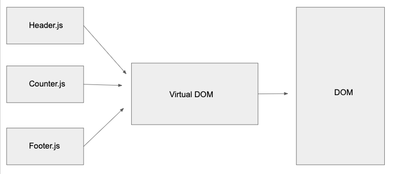

 LAB
=================================================

## React Testing and Deployment

### Author: Melissa Stock

### Links and Resources
* [submission PR](https://github.com/401-advancedjs/react-testing-deployment/pull/2)
* [travis](https://www.travis-ci.com/401-advancedjs/react-testing-deployment)
* [netlify](https://cranky-kepler-f720c8.netlify.com/)
* [aws s3](http://react-testing-deployment.s3-website-us-east-1.amazonaws.com)
* [aws amplify](https://master.d15ydc0hn0c9p.amplifyapp.com/)

#### Documentation
* run `npx styleguidist server`

### Modules
#### `header.js`
#### `footer.js`
#### `counter.js`

#### Running the app
* `npm start`
  
#### Tests
* How do you run tests? `npm run test`
* What assertions were made?
    * On the Counter module:
        * basic rendering
        * increment counter
        * decrement counter
        * snapshot matches (DOM rendering matches)
* What assertions need to be / should be made?
    * All tests on Header and Footer modules.

#### UML

